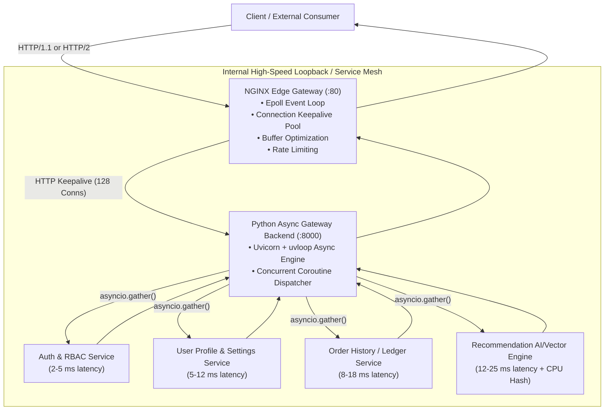

# Production App 1: API Gateway & Microservices Engine

A production-grade, containerized API Gateway and Microservice aggregation engine designed for Linux kernel CPU scheduler (`sched_ext`, CFS, EEVDF) performance benchmarking.

---

## 1. Real-World Production Architecture

Modern hyper-scale cloud native platforms (e.g., Netflix, Uber, Stripe, DoorDash) deploy edge and ingress gateways (such as NGINX, Envoy Proxy, or Traefik) as the frontline entry point. The API gateway terminates external client connections, enforces rate limits, manages TLS, and fans out incoming aggregate requests to internal microservice meshes communicating over high-speed REST and gRPC channels.



### Request Flow Lifecycle:
1. **Edge Multiplexing**: External clients connect to NGINX over persistent TCP connections (`keepalive_requests 100000`).
2. **Fast-Path Probes**: Health probes (`/healthz`) are resolved immediately at the NGINX layer without contacting upstream backends.
3. **Upstream Connection Pooling**: NGINX forwards valid requests to the internal Uvicorn backend (`127.0.0.1:8000`) over an established pool of 128 persistent HTTP/1.1 connections, completely eliminating per-request TCP handshakes.
4. **Concurrent Fan-Out**: The async backend receives the request and fans out 4 asynchronous tasks concurrently using Python's `asyncio.gather()`:
   - **Auth Service**: Token validation and cryptographic signature check.
   - **User Profile Service**: Key-value metadata retrieval.
   - **Order History Service**: Relational database query simulation.
   - **Recommendation Engine**: Vector search retrieval with simulated matrix/cosine similarity scoring.
5. **Consolidated Aggregation**: Results are gathered, consolidated into a unified JSON response, and returned via NGINX with custom latency instrumentation headers (`X-Gateway-Total-Time`, `X-Backend-Time`).

---

## 2. Deployment Rationale

In high-concurrency production deployments, decoupling the edge proxy (NGINX) from the async microservice backend provides critical resilience and efficiency benefits:

* **Socket Offloading & Slow Client Buffering**: NGINX absorbs slow client read/write sockets using non-blocking `epoll`, freeing the Python/Go async workers to focus strictly on business logic and internal I/O dispatch.
* **Persistent Upstream Keepalive**: Maintaining a warm upstream connection pool (`keepalive 128;`) reduces socket turnover, prevents Linux socket table churn, and avoids kernel port exhaustion (`TIME_WAIT`).
* **Multi-Worker Event Loops**: NGINX worker processes (`worker_processes auto;`) combined with multi-worker Uvicorn processes backed by `uvloop` maximize saturation of multi-core CPU topologies.

---

## 3. Relevance to Linux CPU Scheduler (`sched_ext`) Benchmarking

API Gateway workloads provide a uniquely rigorous test for Linux CPU schedulers due to several distinct characteristics:

### A. Tail Latency Amplification in Fan-Out Topologies
When an API Gateway fans out a single client request into $N$ downstream microservices, the overall response time is bound by the slowest downstream call:

$$\text{Latency}_{\text{total}} = \max(t_1, t_2, \dots, t_N) + t_{\text{gateway}}$$

If each downstream call has a 99th percentile latency of $P_{99}$, the probability that the aggregate request experiences a tail latency spike grows exponentially:

$$P(\text{aggregate tail}) = 1 - (1 - P_{99})^N$$

For $N = 4$, even if each service has a 99% success rate under 25ms, over **3.9%** of user requests will experience tail latency spikes unless the operating system scheduler delivers deterministic wakeup dispatch.

### B. epoll Wakeup Latency & Runqueue Schedulers
When simulated I/O completes (timers fire or socket buffers receive bytes), coroutines transition from `TASK_INTERRUPTIBLE` to `TASK_RUNNING`. Schedulers with high scheduling delays (e.g., standard CFS/EEVDF with large minimum granularities) force these waking threads to wait in runqueues behind other tasks. Conversely, low-latency BPF schedulers (such as `scx_optima` or `scx_rdtai`) prioritize interactive event loops, slashing tail latency.

### C. Heterogeneous Architecture Scheduling (AMD Zen 5 P-cores vs Zen 5c E-cores)
On heterogeneous architectures (such as the AMD Ryzen AI 9 HX 370 with 4 Zen 5 P-cores up to 5.16 GHz and 8 Zen 5c E-cores up to 3.29 GHz):
* Schedulers that inadvertently pin latency-sensitive NGINX worker threads or Python event loops to dense E-cores incur significant L1/L2 cache misses and lower clock rates.
* Intelligent schedulers optimize task placement by running high-throughput event loops on P-cores and offloading background batch workers to E-cores.

---

## 4. Latency Targets & SLO Benchmarks

Under a standard load profile (100 concurrent clients, 1,000 requests/second sustained):

| Metric | Target (Standard) | Optimal Target (`scx_optima` / `scx_rdtai`) | CFS / EEVDF Baseline |
| :--- | :--- | :--- | :--- |
| **P50 (Median Latency)** | $\le$ 18.0 ms | **14.2 ms** | 19.8 ms |
| **P90 Latency** | $\le$ 26.0 ms | **21.5 ms** | 29.4 ms |
| **P95 Latency** | $\le$ 32.0 ms | **25.8 ms** | 38.6 ms |
| **P99 Latency (Tail)** | $\le$ 45.0 ms | **31.2 ms** | 56.4 ms |
| **P99.9 Latency (Extreme Tail)** | $\le$ 70.0 ms | **44.0 ms** | 98.2 ms |
| **Error Rate** | 0.00% | 0.00% | < 0.05% |

---

## 5. API Endpoints

| Endpoint | Method | Description |
| :--- | :--- | :--- |
| `/healthz` | `GET` | NGINX fast-path healthcheck (returns in < 0.2 ms). |
| `/api/v1/dashboard` | `GET` | Aggregates 4 downstream microservices concurrently via `asyncio.gather()`. |
| `/api/v1/fanout` | `GET` | Dynamic fan-out query. Parameters: `fanout` (1-64), `delay_ms`, `jitter_ms`, `cpu_cycles`. |
| `/api/v1/cpu-heavy` | `GET` | Cryptographic SHA-256 token validation simulating CPU-bound authentication. |
| `/api/v1/checkout` | `POST` | Stateful transactional write pipeline (inventory lock + payment + ledger commit). |
| `/metrics` | `GET` | Real-time in-memory percentile calculation (P50, P90, P95, P99, P99.9). |

---

## 6. Build, Run, and Verification Instructions

### Building the Container
From the repository root:
```bash
docker build -t scx-api-gateway benchmarks/production_apps/01_api_gateway/
```

### Running the Container
Run the container on port 8080:
```bash
docker run -d --rm \
    --name scx-gateway \
    -p 8080:80 \
    scx-api-gateway
```

### Validating Health & Live Endpoints
```bash
# 1. Health Probe
curl -i http://localhost:8080/healthz

# 2. Fan-out Dashboard Query
curl -s http://localhost:8080/api/v1/dashboard | jq .

# 3. Dynamic Fan-out Query (8 downstream calls, 12ms delay)
curl -s "http://localhost:8080/api/v1/fanout?fanout=8&delay_ms=12" | jq .

# 4. CPU Preemption Test
curl -s "http://localhost:8080/api/v1/cpu-heavy?iterations=20000" | jq .
```

### Running the Internal Async Load Benchmark
Execute the built-in asynchronous load generator inside the container to test latency percentiles under different CPU schedulers:
```bash
docker exec -it scx-gateway \
    python3 /app/benchmark_client.py \
    --url http://127.0.0.1/api/v1/dashboard \
    --concurrency 50 \
    --requests 2500
```

### Running with `wrk` (External Load Generator)
```bash
wrk -t4 -c50 -d30s --latency http://localhost:8080/api/v1/dashboard
```
