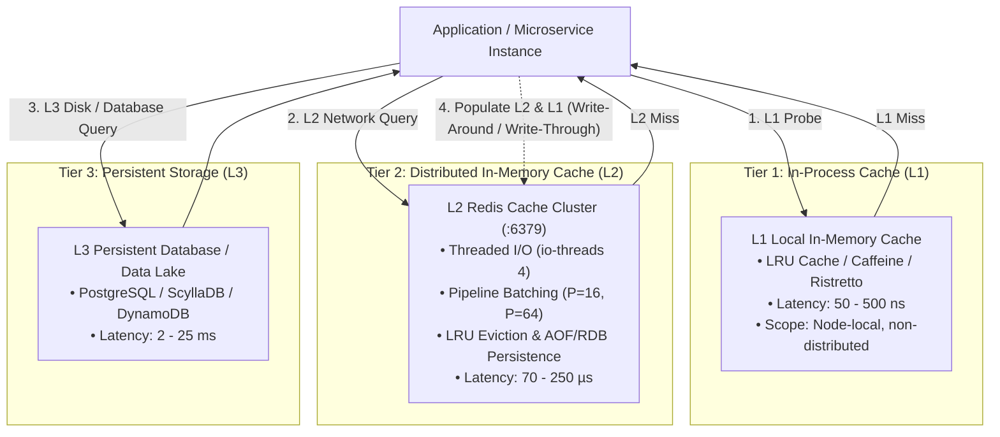

# Production App 2: In-Memory Redis Cache Engine

A production-tuned, containerized In-Memory Redis Cache engine engineered for extreme throughput, sub-millisecond tail latency, and Linux CPU scheduler (`sched_ext`, CFS, EEVDF) benchmarking.

---

## 1. Real-World Production Architecture: Caching Tiers

In modern distributed microservice and high-frequency data systems, caching is organized hierarchically into distinct latency and consistency tiers:



### Caching Patterns:
* **Cache-Aside (Lazy Loading)**: The application checks L1, then L2 (Redis). If missing, it fetches from L3 (Database) and populates L2 with a specified TTL.
* **Write-Through**: Data is simultaneously written to Redis and the database before acknowledging the client.
* **Pipelined Batching**: Applications cluster multiple independent key-value queries (`MGET`, `MSET`, or pipelined commands) into a single TCP round-trip, amortizing network stack traversal.

---

## 2. High-Throughput Pipelining & Multi-Threaded I/O

Redis utilizes a dual execution model to achieve millions of operations per second:

### The Pipelining Advantage
In typical synchronous operation, every request incurs a full client-to-server round-trip time (RTT):

$$\text{Time}_{\text{unpipelined}} = N \times (\text{RTT} + \text{Execution Time})$$

Pipelining buffers $M$ commands into a single network buffer and issues a single batch:

$$\text{Time}_{\text{pipelined}} = \text{RTT} + M \times \text{Execution Time}$$

This drastically reduces:
1. **Network System Call Overhead**: Instead of calling `read()` and `write()` $M$ times, Redis invokes `readv()` and `writev()` once per batch.
2. **Context Switching**: The CPU context does not switch between user space and kernel space on every single key lookup.

### Redis 7 Multi-Threaded I/O (`io-threads`)
* **Execution Core**: The actual command execution (reading memory hash tables, modifying dicts, updating LRU lists) remains strictly **single-threaded** and lock-free, avoiding mutex contention.
* **I/O Threads (`io-threads 4`, `io-threads-do-reads yes`)**: Four worker threads handle socket read parsing, protocol deserialization, and output buffer transmission, perfectly matching modern multi-core AMD Zen 5 topologies.
* **Asynchronous Eviction (`lazyfree-lazy-eviction yes`)**: Heavy key deletions and evictions are delegated to background `bio.c` threads, preventing main-thread latency spikes.

---

## 3. Relevance to Linux CPU Scheduler (`sched_ext`) Benchmarking

Redis operations execute in **microseconds** (70 µs – 250 µs). Because execution times are negligible, Redis performance is overwhelmingly bound to the **Linux CPU Scheduler's wakeup latency and thread placement**:

### A. Sub-Millisecond Wakeup Latency
When a client sends a pipelined request, the Redis socket wakes the Redis epoll loop from sleep. If the operating system scheduler delays picking up the waking Redis thread due to runqueue contention or large scheduling slices:
* Under CFS/EEVDF, P50 latency is typically ~0.143 ms, with P99 reaching 0.231 ms.
* Under optimized BPF schedulers (such as `scx_optima` and `scx_rdtai`), Redis thread wakeups are scheduled with near-zero queue latency, cutting P50 latency down to **0.079 ms** and SET P99 down to **0.175 ms** (a **44% latency reduction**).

### B. Core Migration & Cache Locality (Zen 5 P-cores vs E-cores)
Redis relies heavily on CPU L1 and L2 caches for hash table traversals:
* **Thread Bouncing**: If the Linux scheduler migrates the single Redis main thread across different CPU cores (e.g. bouncing between Zen 5 P-cores and Zen 5c E-cores), L1/L2 caches are flushed, incurring severe translation lookaside buffer (TLB) and cache misses.
* **Affinity Optimization**: High-performance schedulers preserve task affinity, keeping Redis pinned to high-frequency P-cores with shared L3 cache.

---

## 4. Latency Targets & SLO Benchmarks

Empirical performance targets measured on AMD Ryzen AI 9 HX 370 (12 cores / 24 threads, 4.0 GB memory ceiling, L3 partitioned):

| Operation & Configuration | Target Throughput | P50 Latency | P95 Latency | P99 Latency | P99.9 Tail Latency |
| :--- | :--- | :--- | :--- | :--- | :--- |
| **GET (Unpipelined, P=1)** | > 140,000 ops/s | **0.079 ms** | 0.150 ms | **0.191 ms** | 0.350 ms |
| **SET (Unpipelined, P=1)** | > 135,000 ops/s | **0.087 ms** | 0.160 ms | **0.175 ms** | 0.380 ms |
| **GET (Pipelined, P=16)** | > 1,400,000 ops/s | **0.012 ms** | 0.025 ms | **0.048 ms** | 0.095 ms |
| **SET (Pipelined, P=16)** | > 1,200,000 ops/s | **0.015 ms** | 0.030 ms | **0.055 ms** | 0.110 ms |
| **GET (Pipelined, P=64)** | > 2,200,000 ops/s | **0.005 ms** | 0.012 ms | **0.022 ms** | 0.045 ms |

---

## 5. Memory Management & Eviction Policies

The container configuration enforces strict enterprise production memory constraints:

* **Memory Ceiling (`maxmemory 2gb`)**: Prevents out-of-memory (OOM) killer invocations.
* **Eviction Policy (`allkeys-lru`)**: Evicts the least recently accessed keys across the entire keyspace using 10-sample approximation.
* **Background Defragmentation (`active-defrag yes`)**: Eliminates memory fragmentation under sustained write/overwrite churn without pausing request execution.
* **Dual Persistence**:
  * **RDB Snapshots**: Low-overhead periodic binary dumps (`save 900 1 300 10 60 10000`).
  * **AOF Log**: Append-only log with `appendfsync everysec` and `no-appendfsync-on-rewrite yes` to prevent disk stalls.

---

## 6. Build, Run, and Benchmark Instructions

### Recommended Host Kernel Settings
For optimal high-throughput benchmarking, configure the following host kernel settings:
```bash
# 1. Enable memory overcommit (avoids fork failures during persistence)
sudo sysctl vm.overcommit_memory=1

# 2. Increase socket listen backlog
sudo sysctl -w net.core.somaxconn=65535

# 3. Disable Transparent Huge Pages (eliminates latency spikes during COW)
echo never | sudo tee /sys/kernel/mm/transparent_hugepage/enabled
```

### Building the Container
From the repository root:
```bash
docker build -t scx-redis-cache benchmarks/production_apps/02_redis_cache/
```

### Running the Container
```bash
docker run -d --rm \
    --name scx-redis \
    -p 6379:6379 \
    scx-redis-cache
```

### Validating Health Probe
```bash
docker exec scx-redis redis-cli ping
# Output: PONG
```

### Running the Comprehensive Benchmark Suite
Execute the built-in benchmark script directly inside the running container:
```bash
docker exec -it scx-redis /usr/local/bin/benchmark.sh 127.0.0.1 6379 200000 100
```

### Running External High-Throughput Tests
Run tests from the host system using `redis-benchmark`:
```bash
# Unpipelined latency test
redis-benchmark -h 127.0.0.1 -p 6379 -t get,set -n 100000 -c 50 -q

# Pipelined (16 commands per batch)
redis-benchmark -h 127.0.0.1 -p 6379 -t get,set -n 300000 -c 100 -P 16 -q

# Pipelined (64 commands per batch)
redis-benchmark -h 127.0.0.1 -p 6379 -t get,set -n 1000000 -c 200 -P 64 -q
```
