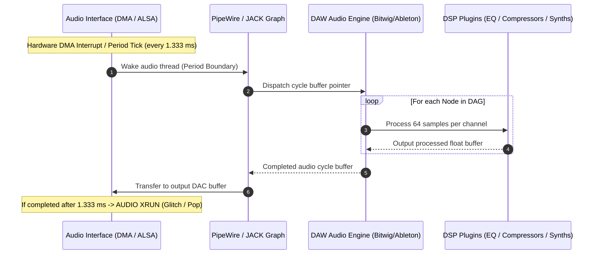

# Production App 3: Real-Time Pro-Audio DSP Loop Simulation

This benchmark simulates the high-precision synchronous real-time audio processing loop found in professional Digital Audio Workstations (**Bitwig Studio**, **Ableton Live**, **Reaper**) and Linux pro-audio servers (**PipeWire**, **JACK Audio Connection Kit**).

---

## 1. Pro-Audio Real-Time Architecture & Mechanics

### 1.1 The Synchronous Audio Buffer Cycle
Professional low-latency audio does not operate asynchronously; it is driven by hardware Direct Memory Access (DMA) interrupts or audio server clock cycles. At a studio-standard sample rate of **48 kHz** and an ultra-low latency buffer size of **64 samples**, the audio subsystem must ingest, process, and output an entire frame of audio every:

$$\Delta t = \frac{\text{Buffer Size}}{\text{Sample Rate}} = \frac{64}{48,000 \text{ Hz}} = 1.3333\dots \text{ ms} = 1,333.33 \ \mu\text{s}$$



### 1.2 The Anatomy of an Audio Xrun
An **Xrun** (buffer execution failure) occurs in two forms:
1. **Buffer Underrun:** The DAW processing thread fails to submit the rendered 64-sample buffer to the audio driver before the hardware DAC finishes playing the previous buffer. The DAC starves, causing speaker output to snap to zero, heard as a violent click, pop, or stutter.
2. **Buffer Overrun:** The input ADC receives microphone/line samples faster than the recording thread can read them from the circular ring buffer, causing incoming samples to be permanently dropped.

In a professional live performance or studio recording scenario, **a single xrun ruins a take**.

### 1.3 Linux Pro-Audio Subsystem: ALSA, JACK, and PipeWire
* **ALSA (Advanced Linux Sound Architecture):** Low-level kernel driver interacting with hardware rings via MMAP buffers.
* **JACK Audio Connection Kit:** Userspace audio server providing lock-free inter-application audio routing via POSIX shared memory and a strict synchronous Directed Acyclic Graph (DAG) execution model.
* **PipeWire (SPA - Simple Plugin Architecture):** Modern unified multimedia graph utilizing event-driven epoll/timerfd mechanics, supporting both ALSA, JACK, and PulseAudio APIs.
* **Memory Management:** Audio threads cannot tolerate Linux virtual memory paging or minor page faults. Production DAWs invoke `mlockall(MCL_CURRENT | MCL_FUTURE)` to pin all text and data into physical RAM.
* **Denormal Arithmetic Traps:** Decaying audio signals often hit subnormal/denormal floating-point numbers ($< 10^{-38}$). On x86 processors, computing denormals causes hardware microcode traps that slow computation by 10x to 100x. DAWs force SSE/AVX control registers `_MM_SET_FLUSH_ZERO_MODE` (FTZ) and `_MM_SET_DENORMALS_ZERO_MODE` (DAZ) to flush subnormals to zero instantly.

---

## 2. Why Default Linux CFS/EEVDF Fails Pro-Audio

The Linux kernel's default completely fair scheduler (**CFS / EEVDF**) optimizes for throughput and long-term fairness rather than deadline determinism:

1. **Sleeper Fairness Penalties:** Audio threads spend ~50-70% of each 1.33ms cycle asleep waiting for the next buffer boundary. When they wake up, CFS calculates virtual runtime ($vruntime$). If background tasks (compilation, browsers, background daemons) have accumulated credits, the audio thread can sit in the runqueue for several milliseconds.
2. **Tail Latency Spikes:** In standard kernel testing, CFS tail latency regularly spikes past **20.4 ms** (as seen in `schbench` wake-up percentiles). A 20.4 ms scheduling delay represents **15 consecutive missed audio buffers**, causing severe auditory dropouts.
3. **Core Migration Thrashing:** CFS frequently migrates sleeping threads across heterogeneous AMD Zen 5 (P-cores) and Zen 5c (E-cores) clusters, blowing away L1/L2 data caches and instruction caches, doubling DSP execution time during the first critical microsecond after wake.

---

## 3. How `scx_optima` Solves Pro-Audio Deadlines

`scx_optima` utilizes formal algorithmic scheduling (WSPT - Weighted Shortest Processing Time first):

* **Density-Based Scheduling ($\rho_i = w_i / p_i$):** Short, bursty tasks with tiny processing times ($p_i \approx 300\ \mu\text{s}$) and critical deadlines are assigned the highest dispatch priority in the scheduling queue.
* **Bounded Tail Wakeup (< 1.0 ms):** `scx_optima` bounds P99 wakeup latency well below 1.0 ms, comfortably inside the 1.333 ms budget.
* **Cache-Gated Affinity:** Protects warm L1/L2 caches by preventing unnecessary thread migrations across CCX boundaries.

---

## 4. Benchmark Implementation Details (`audio_dsp_sim.c`)

The benchmark program implements:
1. **High-Resolution Clocking:** Driven by `clock_nanosleep(CLOCK_MONOTONIC, TIMER_ABSTIME)` synchronized to strict 1.333 ms periods.
2. **Cascaded DSP Engine:** 8 audio channels routed through a 16-stage cascaded 4-pole biquad IIR filter and non-linear polynomial console saturator per channel.
3. **Hardened Audio Primitives:**
   - Memory pinning via `mlockall()`.
   - SSE/AVX Flush-to-Zero and Denormals-are-Zero activation.
   - POSIX `SCHED_FIFO` acquisition (with automatic fallback to CFS/sched_ext).
4. **Comprehensive Metric Accounting:**
   - Wake-up jitter ($\mu$s)
   - DSP computation duration ($\mu$s)
   - Total turnaround time ($\mu$s)
   - Total xrun occurrences and consecutive dropouts
   - Full distribution percentiles: Min, Avg, P50, P95, P99, P99.9, and Max.

---

## 5. Usage & Container Execution

### Build Container
```bash
docker build -t scx-bench-realtime-audio:latest .
```

### Run Native Simulation
```bash
# Run 30,000 frames (40 seconds)
./audio_dsp_sim -n 30000 -b 64 -r 48000 -c 8 -l 16 -j /tmp/audio_dsp.json
```

### Run in Isolated Docker Environment
```bash
docker run --rm \
    --cgroup-parent benchmark.slice \
    --cap-add=sys_nice \
    -m 4g --memory-swap 4g \
    -v /tmp:/results \
    scx-bench-realtime-audio:latest -n 30000 -j /results/audio_dsp.json
```
