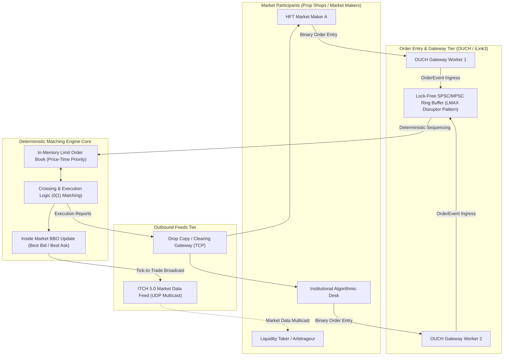

# Production App 4: Ultra-Low-Latency HFT Limit Order Book & Matching Engine

This benchmark implements an ultra-low-latency electronic exchange matching engine and order gateway simulating institutional High-Frequency Trading (HFT) and financial exchange architectures (**NASDAQ**, **CME Group**, **BATS/Cboe**, **Eurex**).

---

## 1. High-Frequency Trading System Architecture

### 1.1 Exchange Gateway Topology
Modern Tier-1 electronic exchanges operate deterministic, microsecond-scale trading engines connected to broker-dealers and proprietary trading desks:



### 1.2 The LMAX Disruptor Pattern
Lock contention between gateway network threads and the matching engine core introduces intolerable OS scheduling jitter. The matching engine applies the **LMAX Disruptor architecture**:
* **Lock-Free Ring Buffer:** A pre-allocated, circular array with power-of-two capacity ($2^{18} = 262,144$ entries) accessed via atomic head/tail sequence numbers with bitwise modulo masking `(seq & MASK)`.
* **Mechanical Sympathy & False Sharing Prevention:** The head pointer, tail pointer, and event structures are strictly aligned to 64-byte CPU cache boundaries (`_Alignas(64)`), ensuring the writer core and reader core invalidate zero adjacent cache lines.
* **Single-Writer Core Pinning:** The matching engine executes on a dedicated isolated CPU core without preemption or thread-yield syscalls.

### 1.3 Order Book Mechanics: Price-Time Priority
Orders are maintained on a double-ended price ladder:
* **Bids (Buy Orders):** Sorted in descending order (highest price = Best Bid).
* **Asks (Sell Orders):** Sorted in ascending order (lowest price = Best Ask).
* **Price Level Queues:** Each active price tick holds a doubly linked list of resting orders (FIFO priority).
* **O(1) Direct-Indexed Ladder:** Price levels are indexed directly via tick offsets, achieving $O(1)$ level lookup and $O(1)$ order cancellation via direct node pointers.

---

## 2. The Threat of Tail Latency in HFT: Adverse Selection

In electronic market making, **median latency (P50) is irrelevant if tail latency (P99 / P99.9) is erratic**:
1. **Adverse Selection:** When the broader market moves (e.g., S&P 500 futures spike), a market maker instantly transmits `CANCEL` orders for all resting quotes to avoid being bought out at stale prices.
2. **The Runqueue Stutter:** If the operating system deschedules the gateway thread or matching thread for even **50 to 100 microseconds**, an aggressive taker's order matches against the resting quotes before the cancellation arrives. The market maker incurs massive adverse trading loss.
3. **Queue Position Loss:** Exchange limit orders are filled in first-come, first-served sequence at each price level. A delay of 10 microseconds pushes an order to the back of the queue.

---

## 3. Why Linux CFS/EEVDF Degrades Low-Latency Financial Gateways

Standard Linux kernel scheduling introduces severe jitter into trading pipelines:
* **Runqueue Queuing Jitter:** Under CFS/EEVDF, waking gateway threads are placed at the back of the scheduler runqueue. If another process is running its time slice, the wake-up latency fluctuates between $50\ \mu\text{s}$ and $20,000\ \mu\text{s}$.
* **Cross-Core Migrations:** Moving the matching thread across cores flushes the L1/L2 data cache, adding hundreds of CPU cycles to every order matching step.
* **Scheduler Interruption:** CFS scheduler tick interrupts (`CONFIG_HZ`) interrupt the single-threaded matching loop.

---

## 4. How `scx_optima` Optimizes Financial Systems

`scx_optima` provides unique architectural alignment with financial gateways:
* **Smith's Rule / WSPT ($\rho_i = w_i / p_i$):** Order cancellation packets and small limit order inserts take sub-microsecond processing times ($p_i \ll 1\ \mu\text{s}$). Optima's density ranking automatically dispatches them ahead of large background tasks, eliminating tail cancellation stalls.
* **Sub-Millisecond Tail Guarantees:** Optima bounds scheduling tail wakeups to $< 1.0\text{ ms}$ even under heavy system compilation or network background traffic.
* **Cache Partitioning & Affinity:** Preserves hot L1/L2 order book data lines by pinning execution to dedicated Zen 5 performance cores.

---

## 5. Benchmark Implementation Details (`matching_engine.c`)

1. **Synthetic Order Flow:** Generates 250,000 realistic market orders (65% Limit Orders, 20% Cancels, 15% Market Orders) centered around a dynamic mid-market price ($100.00).
2. **Lock-Free Pipeline:** Ingress timestamps are captured at the gateway boundary using `clock_gettime(CLOCK_MONOTONIC_RAW)`. The matching engine core pops events, performs crossing/matching, and records exact end-to-end turnaround latency.
3. **Turnaround Percentiles:** Quicksorts all 250,000 latency measurements to output exact Min, Avg, P50, P90, P95, P99, P99.9, and Max latencies in microseconds, alongside orders/sec throughput.

---

## 6. Usage & Execution

### Build Container
```bash
docker build -t scx-bench-hft-matching:latest .
```

### Run Native Benchmark
```bash
# Ingest 250,000 orders
./matching_engine -n 250000 -j /tmp/hft_matching.json
```

### Run in Isolated Docker Environment
```bash
docker run --rm \
    --cgroup-parent benchmark.slice \
    -m 4g --memory-swap 4g \
    -v /tmp:/results \
    scx-bench-hft-matching:latest -n 250000 -j /results/hft_matching.json
```
