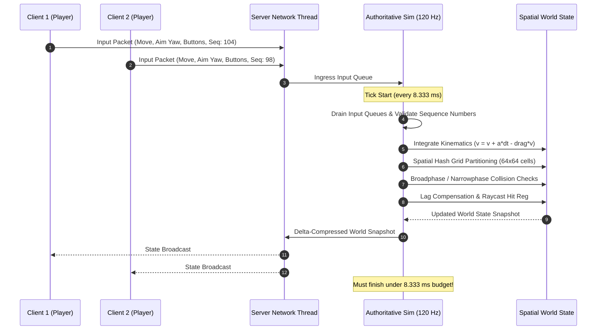

# Production App 5: 120 FPS Interactive Game Server & Tick Broadcaster

This benchmark implements a high-performance authoritative multiplayer game simulation server running a strict **120 FPS (8.333 ms tick deadline)** simulation loop, replicating modern competitive esports server engines (**Valve Source 2 / CS2**, **Riot Games Valorant 128-tick servers**, **Unreal Engine 5 Network Driver**).

---

## 1. Multiplayer Game Server Architecture

### 1.1 The Authoritative Server Model
In competitive multiplayer games, clients are untrusted rendering terminals. The server executes the single source of ground truth:



### 1.2 The Fixed Timestep Accumulator Pattern
Unlike single-player rendering loops that scale with dynamic delta times ($\Delta t$), competitive servers enforce a **deterministic fixed timestep**:

$$\Delta t_{\text{tick}} = \frac{1}{\text{Tick Rate}} = \frac{1}{120 \text{ Hz}} = 8.3333\dots \text{ ms} = 8,333.33 \ \mu\text{s}$$

Physics equations require constant delta times to avoid numerical instability, deterministic rollback divergence, and physics tunneling.

### 1.3 Client Prediction, Server Reconciliation, and Lag Compensation
1. **Client-Side Prediction:** Players immediately display their own movement locally without waiting for the server round-trip.
2. **Server Reconciliation:** When the authoritative server broadcast arrives, the client compares its predicted position with the server snapshot. If the server desynchronizes due to a dropped server tick, the client is forced to "snap" back to the server coordinate—visible to players as jarring **rubber-banding**.
3. **Lag Compensation (Rewind Buffer):** When a player fires a weapon, the server queries a circular history buffer of entity positions, rewinds the game world back to the exact millisecond the player fired, performs the raycast hit check, and steps back to the present.

---

## 2. The Catastrophic Cost of Server Tick Jitter

A game server that averages 3.0 ms of execution time can still fail catastrophically if the OS scheduler produces tail jitter:

1. **Rubber-Banding & Desynchronization:** If tick execution spikes past 8.333 ms, the server misses its network broadcast window. Clients receive two ticks grouped together (bursting), causing interpolation buffers to deplete and player avatars to teleport.
2. **"Hit-Reg" (Hit Registration) Invalidation:** When a server tick is delayed, the lag compensation rewind buffer samples incorrect historical timestamps, causing clean crosshair shots to register as misses.
3. **Player Frame Hitching:** Client renderers interpolate between server state packets. Jittery packet arrival times induce micro-stutters even on 240 Hz monitors.

---

## 3. Why Standard Linux Schedulers Hurt Game Servers

* **CFS Preemption Mid-Frame:** The standard Linux Completely Fair Scheduler distributes timeslices fairly among all running threads. If a background daemon or logging thread is granted CPU time during the 8.333 ms tick window, the game server is preempted mid-simulation, blowing the frame budget.
* **Sleeping Thread Wakeup Delay:** Game servers sleep for several milliseconds between ticks (`time.sleep` / `clock_nanosleep`). Under CFS, sleeping threads lose CPU affinity and wake up on overloaded cores with cold caches, taking several milliseconds just to reach the CPU execution pipeline.

---

## 4. How `scx_optima` Enforces 120 FPS Pacing

`scx_optima` provides purpose-built algorithmic advantages for gaming workloads:
* **Short-Burst WSPT Prioritization:** The game server execution pulse ($\sim 200\text{--}800\ \mu\text{s}$ per tick) is recognized as a short processing burst ($p_i$), placing the tick thread at the head of the dispatch queue.
* **Bounded Wakeup Guarantee (< 1.0 ms):** Guarantees the server wakes up immediately at the 8.333 ms boundary without queuing delay.
* **Core Affinity Protection:** Keeps simulation state within hot Zen 5 L1/L2 caches, eliminating inter-core cache migration penalties.

---

## 5. Benchmark Implementation Details (`game_server.py`)

1. **500 Concurrent Clients:** Spawns a background networking worker feeding realistic client movements, aim angles, and action buttons into an ingress queue.
2. **Spatial Hash Grid:** Entities are mapped into a $64 \times 64$ 2D spatial grid (10.0m cell size) executing realistic broadphase and narrowphase collision queries.
3. **Kinematics & Snapshot Serialization:** Integrates velocity, drag damping, boundary collision, and snapshot payload preparation.
4. **Pacing Metrics:** Records high-resolution `time.perf_counter_ns()` telemetry:
   - Tick execution duration ($\mu$s)
   - Tick-to-tick interval pacing ($\mu$s)
   - Interval jitter deviation ($\mu$s)
   - Frame drops / deadline misses (> 8.333 ms)
   - Full percentiles: Min, Avg, P50, P90, P95, P99, and Max.

---

## 6. Usage & Execution

### Build Container
```bash
docker build -t scx-bench-game-server:latest .
```

### Run Native Benchmark
```bash
# Run 30 seconds at 120 FPS with 500 connected clients
python3 game_server.py -c 500 -d 30 -r 120 -j /tmp/game_server.json
```

### Run in Isolated Docker Environment
```bash
docker run --rm \
    --cgroup-parent benchmark.slice \
    -m 4g --memory-swap 4g \
    -v /tmp:/results \
    scx-bench-game-server:latest -c 500 -d 30 -j /results/game_server.json
```
