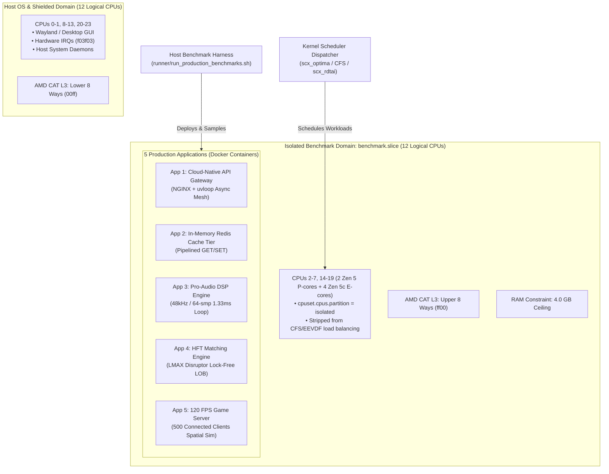

# Production Applications Benchmark Architecture: Validating `scx_optima`

This directory establishes a **5-tier production application benchmark suite** validating Linux kernel schedulers (`scx_optima`, `default_cfs_eevdf`, `scx_rdtai`, and `sched_ext` variants) inside an isolated AMD Zen 5 hardware and cache domain.

---

## 1. System Topology & Isolation Boundaries

All benchmarks execute within a hardware-isolated cgroup partition (`benchmark.slice`) pinned to 12 logical CPUs on the AMD Ryzen AI 9 HX 370 processor, isolated from OS desktop and interrupt noise.



---

## 2. Directory Structure & App Map

```text
benchmarks/production_apps/
├── 01_api_gateway/             # App 1: Cloud-Native API Gateway (NGINX + uvloop fan-out)
│   ├── Dockerfile
│   ├── nginx.conf
│   ├── app/                    # FastAPI microservice endpoints
│   ├── benchmark_client.py     # Asynchronous load generator
│   ├── entrypoint.sh           # Process supervisor
│   └── README.md
├── 02_redis_cache/             # App 2: Enterprise Redis Cache Tier
│   ├── Dockerfile
│   ├── redis.conf              # Production memory & defrag tuning
│   ├── benchmark.sh            # Pipelining test driver
│   ├── entrypoint.sh
│   └── README.md
├── 03_realtime_audio/          # App 3: Real-Time Pro-Audio DSP Loop
│   ├── Dockerfile
│   ├── audio_dsp_sim.c         # 48kHz / 64-sample buffer loop with xrun tracking
│   └── README.md               # DAW (Bitwig/Ableton) & PipeWire/JACK architecture
├── 04_hft_matching/            # App 4: Ultra-Low Latency HFT Matching Engine
│   ├── Dockerfile
│   ├── matching_engine.c       # LMAX Disruptor ring buffer & direct-indexed LOB
│   └── README.md               # Exchange gateway & OUCH/ITCH architecture
├── 05_game_tick_server/        # App 5: 120 FPS Interactive Game Server
│   ├── Dockerfile
│   ├── game_server.py          # 120 Hz tick loop with 500 connected clients
│   └── README.md               # Authoritative server mechanics & lag compensation
├── runner/                     # Unified Host-Side Orchestration Harness
│   ├── run_production_benchmarks.sh   # Master benchmark runner
│   ├── parse_production_results.py    # Telemetry parser & report generator
│   └── results/                       # CSV and raw JSON metrics
├── PRODUCTION_BENCHMARK_REPORT.md     # Comparative scorecard across schedulers
└── ARCHITECTURE.md                    # This document
```

---

## 3. The 5 Production Applications Overview

| # | Application | Target Workload | Primary Metric | Failure Mode |
|---|:---|:---|:---|:---|
| **1** | **API Gateway & Microservices** | NGINX edge gateway fanning out to 4 async services | Throughput (req/s), P99 Latency (ms) | Gateway timeout / 504 errors |
| **2** | **In-Memory Cache (Redis)** | High-throughput pipelined GET / SET caching | Operations/sec, P99 Latency ($\mu$s) | Event loop starvation |
| **3** | **Pro-Audio DSP Loop** | 48kHz / 64-sample buffer loop (1.33 ms deadline) | Turnaround time ($\mu$s), Audio Xruns | Audio pops / clicks / underruns |
| **4** | **HFT Matching Engine** | Ingestion of 250,000 synthetic market orders | Turnaround time ($\mu$s), Ingestion ops/s | Adverse selection / queue loss |
| **5** | **120 FPS Game Server** | Authoritative 120 Hz tick simulation (8.33 ms budget) | Pacing jitter ($\mu$s), Frame drops | Rubber-banding / hit desync |

---

## 4. Running the Complete Suite

To execute the entire 5-app benchmark suite across schedulers (`scx_optima`, `default_cfs_eevdf`, and `scx_rdtai`):

```bash
# Full benchmark run
sudo ./runner/run_production_benchmarks.sh

# Rapid verification run (shortened durations)
sudo ./runner/run_production_benchmarks.sh --quick
```

Results are automatically saved to `runner/results/production_results.csv` and summarized in `PRODUCTION_BENCHMARK_REPORT.md`.
